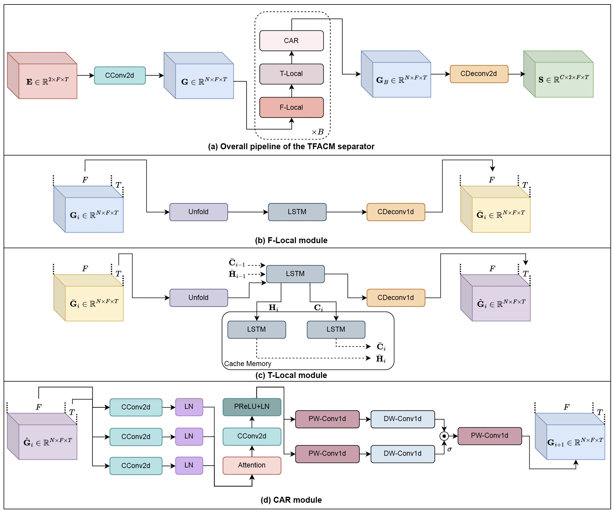
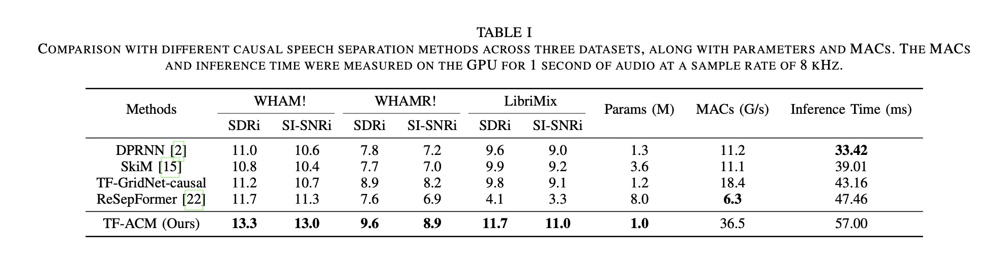

<h3  align="center">Time-Frequency-Based Attention Cache Memory Model for Online Speech Separation</h3>
<p align="center">
  <strong>Guo Chen<sup>*</sup>, Kai Li<sup>*</sup>, Runxuan Yang, Xiaolin Hu</strong><br>
    <strong>Tsinghua University</strong><br>
    <strong><sup>*</sup>Equal contribution</strong><br>
  <a href="YOUR_ARXIV_LINK_HERE">📜 Paper</a> | <a href="YOUR_DEMO_LINK_HERE">🎶 Demo</a> | <a href="YOUR_DATASET_LINK_HERE">🤗 Dataset</a> <!-- TODO: Update links -->

<p align="center">
   <!-- TODO: Update JusperLee -->
   <!-- TODO: Update JusperLee -->
   <!-- TODO: Update license if needed, e.g., Apache 2.0 -->
</p>

<p align="center">

> TFACM is a causal speech separation method that models spatio-temporal relationships and uses an attention mechanism with cache memory.

## 📜 Abstract

Existing causal speech separation models have a significant performance gap compared to non-causal models, due to the difficulty in retaining historical information. To address this issue, we introduce a causal speech separation method called the Time-Frequency Attention Cache Memory model (TFACM). It models the spatio-temporal relationships between the time and frequency dimensions and an attention mechanism. Specifically, we use the LSTM layer to capture the relative spatial positions in the frequency dimension, while causal modeling is performed in the time dimension using both local and global representations, with a cache memory (CM) module introduced to store historical information. Additionally, we introduce a causal attention refinement (CAR) module to optimize the representation in the time dimension, thereby achieving finer-grained feature representations. Experimental results on public datasets demonstrated that TFACM significantly outperformed existing methods in speech separation performance, showcasing its robust capabilities in complex environments.

## Model Architecture

Overall pipeline of the TFACM separator and modules in it. Here, CConv represents the causal convolutional layer, CDeconv represents the causal transposed convolutional layer, and PW/DW-Conv represents the point-wise/depth-wise convolutional layer.



## Results

TFACM outperformed previous SOTA causal models, including SKiM and ReSepFormer, with SDRi gains of 1.6 dB, 1.8dB and 1.9 dB on the WHAM!, the WHAMR! and LibriMix datasets.




## 📦 Installation

```bash
git clone https://github.com/JusperLee/TFACM.git # TODO: Update JusperLee with your GitHub username
cd TFACM
pip install -r requirements.txt
```

## 🚀 Quick Start

### Training

```shell
python process_librimix.py --in_dir=xxxx --out_dir=DataPreProcess/Libri2Mix
python audio_train.py --conf_dir=configs/tfacm_causal_librimix.yml
```

### Evaluation

```shell
python audio_test.py --conf_dir=Experiments/checkpoint/TFACM-librmix/conf.yml
```

## 📖 Citation

If you find this work useful for your research, please consider citing:

```bibtex
@article{chenYYYYtfacm, # TODO: Update with your citation key (e.g., chen2024tfacm) and year
  title={Time-Frequency-Based Attention Cache Memory Model for Online Speech Separation},
  author={Guo Chen and Kai Li and Runxuan Yang and Xiaolin Hu},
  journal={arXiv preprint arXiv:XXXX.XXXXX or Conference Proceedings}, # TODO: Update with your publication details
  year={YYYY} # TODO: Update with the year
}
```

## 📧 Contact

If you have any questions, please feel free to contact us via `tsinghua.kaili@gmail.com`. <!-- TODO: Update with your contact email -->
